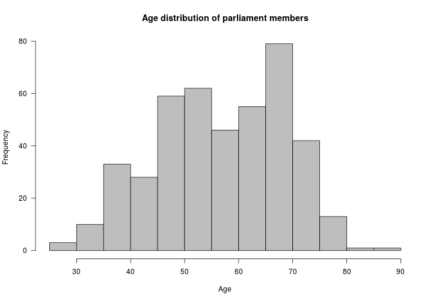

<!--
%\VignetteEngine{knitr::rmarkdown}
%\VignetteIndexEntry{finpar Markdown Vignette}
%\usepackage[utf8]{inputenc}
-->


Parliament of Finland: unofficial API client
===========

This R package provides tools to access Parliament of Finland data
from the unofficial [Kansan Muisti](http://kansanmuisti.fi)
2.0 [API](http://kansanmuisti.fi/api/v1/). For API documentation,
check [here](http://dev.kansanmuisti.fi/static/api_v1_doc/index.html).


## Installation and usage

[Installing the package](#installation) (Installing the package)  
[Gender analysis](#genders) (Estimating genders)  

### Available data sources and tools

The following API endpoints are currently wrapped by `finpar`:

| Data                | API endpoint                       | Function                           |
|---------------------|------------------------------------|------------------------------------|
| Parliamentary terms | [http://kansanmuisti.fi/api/v1/term](http://kansanmuisti.fi/static/api_v1_doc/index.html#api-Term) | `term()` |
| Members of the Parliament | [http://kansanmuisti.fi/api/v1/member](http://kansanmuisti.fi/static/api_v1_doc/index.html#api-Member) | `member()` |
| Plenary sessions | [http://kansanmuisti.fi/api/v1/plenary_session](http://kansanmuisti.fi/static/api_v1_doc/index.html#api-Plenary_Session) | `plenary_session()` |


## <a name="installation"></a>Installation

Install the development version:


```r
library(devtools)
install_github("ropengov/finpar")
```

Load the library:


```r
library(finpar)
```

Set UTF-8 encoding:


```r
Sys.setlocale(locale="UTF-8") 
```

## <a name="terms"></a>Parliament terms

All terms of the Finnish parliament in 1907-2011


```r
all_terms <- term()
# Show the first ones in a table:
library(knitr)
kable(head(all_terms))
```


|begin      |end        |name | id|
|:----------|:----------|:----|--:|
|2011-04-20 |NA         |2011 |  1|
|2007-03-21 |2011-04-19 |2007 |  2|
|2003-03-19 |2007-03-20 |2003 |  3|
|1999-03-24 |2003-03-18 |1999 |  4|
|1995-03-24 |1999-03-23 |1995 | 36|
|1991-03-22 |1995-03-23 |1991 | 35|

Get a specific term defined by ID  


```r
term_2011 <- term(id=1)  
print(term_2011)
```

```
##        begin end name id
## 1 2011-04-20  NA 2011  1
```


## <a name="members"></a>Parliament members

Get all parliament members and plot their age distribution


```r
all_members <- member()
ages <- sapply(all_members, function (x) {x$age})
hist(ages, col = "gray", xlab = "Age", main = "Age distribution of parliament members", las = 1)
```

 

Get a specific member defined by ID:


```r
jorn_donner <- member(id=30)  

# List available variables
print(names(jorn_donner))
```

```
##  [1] "activity_days_included" "activity_score"        
##  [3] "age"                    "all_posts"             
##  [5] "birth_date"             "birth_place"           
##  [7] "district_name"          "email"                 
##  [9] "gender"                 "given_names"           
## [11] "homepage_link"          "id"                    
## [13] "info_link"              "last_checked_time"     
## [15] "last_modified_time"     "name"                  
## [17] "origin_id"              "party"                 
## [19] "party_associations"     "phone"                 
## [21] "photo"                  "posts"                 
## [23] "print_name"             "resource_uri"          
## [25] "stats"                  "summary"               
## [27] "surname"                "terms"                 
## [29] "url_name"               "wikipedia_link"
```

```r
# Check age
jorn_donner$age
```

```
## [1] 82
```


## <a name="members"></a>Plenary sessions

Get all plenary sessions 


```r
all_plenary_sessions <- plenary_session()
```
  
Get a specific plenary session defined by ID


```r
session <- plenary_session(id=30)  

# List available variables
kable(session)
```


|id | field|element            |value                                                                |
|:--|-----:|:------------------|:--------------------------------------------------------------------|
|30 |     1|date               |2012-11-23                                                           |
|30 |     1|info_link          |http://www.eduskunta.fi/triphome/bin/akxptk.sh?{KEY}=PTK+116/2012+vp |
|30 |     1|last_checked_time  |2013-12-01T00:00:00                                                  |
|30 |     1|last_modified_time |NA                                                                   |
|30 |     1|name               |116/2012                                                             |
|30 |     1|origin_id          |116/2012                                                             |
|30 |     1|origin_version     |2.0                                                                  |
|30 |     1|plenary_votes      |/api/v1/plenary_vote/1244/                                           |
|30 |     2|plenary_votes      |/api/v1/plenary_vote/1245/                                           |
|30 |     3|plenary_votes      |/api/v1/plenary_vote/1246/                                           |
|30 |     4|plenary_votes      |/api/v1/plenary_vote/1247/                                           |
|30 |     5|plenary_votes      |/api/v1/plenary_vote/1248/                                           |
|30 |     6|plenary_votes      |/api/v1/plenary_vote/1249/                                           |
|30 |     7|plenary_votes      |/api/v1/plenary_vote/1250/                                           |
|30 |     8|plenary_votes      |/api/v1/plenary_vote/1251/                                           |
|30 |     9|plenary_votes      |/api/v1/plenary_vote/1252/                                           |
|30 |     1|resource_uri       |/api/v1/plenary_session/30/                                          |
|30 |     1|url_name           |116-2012                                                             |


## <a name="gender"></a>Genders

Use genderizeR package to estimate gender for first names (note that there might be [some inaccuracies in gender estimation for Finnish names](https://github.com/rOpenGov/finpar/issues/2))


```r
# devtools::install_github("kalimu/genderizeR")
library(genderizeR)
x <- c("Sauli", "Tarja", "Mauno")
givenNames <- findGivenNames(x, progress = FALSE)
```


```r
g <- genderize(x, genderDB=givenNames, blacklist=NULL, progress = FALSE)
```

```r
kable(g)
```


|text  |givenName |gender | genderIndicators|
|:-----|:---------|:------|----------------:|
|Sauli |sauli     |male   |                1|
|Tarja |tarja     |female |                1|
|Mauno |mauno     |male   |                1|

## Related 

 * R code to calculate [co-sponsorship networks from bills (and motions) passed in the Finnish Parliament](https://github.com/briatte/eduskunta/)


## Acknowledgements

R client for the unofficial API of [Parliament of Finland](http://web.eduskunta.fi/Resource.phx/parliament/index.htx) provided by NGO [Kansan Muisti](http://www.kansanmuisti.fi/about/background/). Parliament of Finland does not provide an official API, but Kansan Muisti does provide a RESTful API to a database mostly compiled by scraping data from parliament's web page. Great work !


## Licensing and Citations

This work can be freely used, modified and distributed under the 
[MIT license](http://en.wikipedia.org/wiki/MIT_License).


```r
citation("finpar")
```

```
## 
## Kindly cite the finpar R package as follows:
## 
##   (C) Joona Lehtomaki 2014-2015. finpar: R tools for Finnish
##   Parliament Data from the unofficial Kansan Muisti API. URL:
##   http://github.com/ropengov/finpar
## 
## A BibTeX entry for LaTeX users is
## 
##   @Misc{,
##     title = {finpar: R tools for Finnish Parliament Data from the unofficial Kansan Muisti API},
##     author = {Joona Lehtomaki},
##     year = {2014-2015},
##   }
## 
## Many thanks to http://kansanmuisti.fi !
```

## Session info

This vignette was created with


```r
sessionInfo()
```

```
## R version 3.1.2 (2014-10-31)
## Platform: x86_64-pc-linux-gnu (64-bit)
## 
## locale:
##  [1] LC_CTYPE=en_US.UTF-8       LC_NUMERIC=C              
##  [3] LC_TIME=en_US.UTF-8        LC_COLLATE=en_US.UTF-8    
##  [5] LC_MONETARY=en_US.UTF-8    LC_MESSAGES=en_US.UTF-8   
##  [7] LC_PAPER=en_US.UTF-8       LC_NAME=C                 
##  [9] LC_ADDRESS=C               LC_TELEPHONE=C            
## [11] LC_MEASUREMENT=en_US.UTF-8 LC_IDENTIFICATION=C       
## 
## attached base packages:
## [1] stats     graphics  grDevices utils     datasets  methods   base     
## 
## other attached packages:
## [1] genderizeR_1.0.0.1 finpar_0.1.2       reshape2_1.4.1    
## [4] httr_0.6.1         knitr_1.9         
## 
## loaded via a namespace (and not attached):
##  [1] assertthat_0.1    bitops_1.0-6      chron_2.3-45     
##  [4] data.table_1.9.4  DBI_0.3.1         dplyr_0.4.1      
##  [7] evaluate_0.5.5    formatR_1.0       jsonlite_0.9.14  
## [10] lazyeval_0.1.10   magrittr_1.5      NLP_0.1-6        
## [13] parallel_3.1.2    plyr_1.8.1        R.cache_0.10.0   
## [16] Rcpp_0.11.5       RCurl_1.95-4.5    R.methodsS3_1.7.0
## [19] R.oo_1.19.0       R.utils_2.0.0     slam_0.1-32      
## [22] stringr_0.6.2     tm_0.6            tools_3.1.2
```


